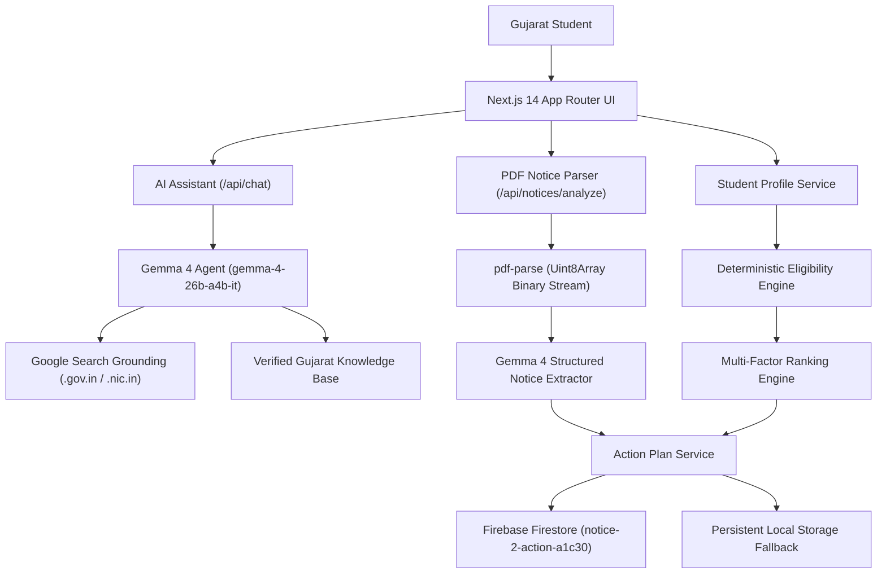

**👉 https://notice2action.netlify.app**

### 🚀 Live Application
**👉 https://notice2action.netlify.app/**

### ▶️ Watch the Full Product Walkthrough

**🎬 New here? Watch this video first to understand the product, workflow, AI features, and overall user experience.**

<p align="center">
  <a href="https://youtu.be/l8BEqQ748bw">
    
  </a>
</p>

<p align="center">
  <a href="https://youtu.be/l8BEqQ748bw"><strong>▶ Watch Notice2Action on YouTube</strong></a>
</p>

# Notice2Action

> **From Government Notice to Student Action.**  
> An autonomous open-source education intelligence agent for Gujarat students that transforms complex government notifications and circulars into personalized, verified action plans.

Built for the **Open-Source AI & Autonomous Agents** Hackathon.  
GitHub: [https://github.com/Ridham1409/Notice-2-action](https://github.com/Ridham1409/Notice-2-action)

---

## 📌 Problem

Gujarat students face hundreds of fragmented educational notifications, government resolutions (GRs), scholarship cutoffs, entrance exam circulars, and centralized admission schedules scattered across disparate departmental portals (`mysy.gujarat.gov.in`, `digitalgujarat.gov.in`, `gseb.org`, `acpc.gujarat.gov.in`). 

Key challenges:
1. **Notification Complexity:** Government circulars are 10–30 pages of dense legalistic Gujarati and English text.
2. **Double-Dipping & Strict Cutoffs:** Schemes like MYSY strictly enforce an 80th percentile benchmark, family income ceilings (₹6.00 Lakh), and distinct institutional Help Centre physical verification cutoffs.
3. **Misleading Speculation:** Secondary aggregators and social media forums frequently invent future dates or quote expired academic cycles as active deadlines.
4. **Action Paralysis:** Students don't know: *Am I eligible? What documents do I need? What is my exact next step?*

---

## 💡 Solution

**Notice2Action** is an autonomous education intelligence agent. It does not just summarize notifications; it executes a deterministic, multi-stage reasoning pipeline:
1. **Reads the Student Profile** (degree, marks/percentile, category, income, domicile, hosteller status).
2. **Parses Uploaded Circular PDFs** via direct binary text extraction and Gemma 4 reasoning.
3. **Evaluates Statutory Eligibility Deterministically** using statutory rules (never delegated to LLM guesswork).
4. **Validates Deadlines with Real-Time Web Grounding** across official Gujarat `.gov.in` and `.nic.in` domains.
5. **Generates an Executable Action Plan** with deadline reminders and document checklists.

---

## ⚡ Core Features

- **AI Education Assistant (Gemma 4):** Conversational intelligence supporting English, Gujarati, and Gujarati transliteration (e.g., *"Mara mate atyare kai scholarship relevant che?"*, *"MYSY ni deadline su che?"*).
- **PDF Notice Intelligence:** Drag-and-drop government PDF parser extracting critical dates, physical verification rules, warnings, and document requirements.
- **Deterministic Eligibility Engine:** Concrete statutory verification for MYSY, Digital Gujarat Post-Matric, ISEL Loan Subsidy, and SHODH Ph.D. fellowship.
- **Multi-Factor Opportunity Matching:** Scores and ranks schemes based on student eligibility, academic stream, and upcoming cutoffs.
- **Deadline Intelligence:** Tracks Original, Extended, and Help Centre Physical Verification cutoffs, clearly distinguishing confirmed dates from `NOT ANNOUNCED` future cycles.
- **Persistent Action Plan:** Interactive task timeline and document checklist that saves to localStorage and Firebase Firestore.
- **Source-Grounded Answers:** Direct links to primary `.gov.in` departments, timestamps, and verifiable evidentiary standards.

---

## 🏗️ Architecture



---

## 🛠️ Tech Stack

- **Framework:** Next.js 14 (App Router), React 18, TypeScript
- **Styling:** Tailwind CSS, Lucide Icons, clsx, tailwind-merge
- **AI / LLM:** Google GenAI SDK (`gemma-4-26b-a4b-it`) with Google Search web grounding
- **PDF Parsing:** `pdf-parse` (Uint8Array cross-platform engine)
- **Database & Cloud:** Firebase Modular SDK v12 (Firestore & Cloud Storage)
- **Deployment:** Vercel / Cloud Run compatible

---

## 🤖 AI & Gemma 4 Integration

The agent leverages **`gemma-4-26b-a4b-it`** with native Google Search grounding:
- **Strict Anti-Hallucination:** If an examination or admission cycle date is not officially released by the statutory board (e.g. `GUJCET 2027`), the model explicitly reports **`NOT ANNOUNCED`** and warns against speculative rumors.
- **Grounded Verification:** Prioritizes `*.gujarat.gov.in`, `*.nic.in`, `gseb.org`, and `acpc.gujarat.gov.in`.
- **Multi-Lingual Reasoning:** Automatically matches the user's language in Gujarati or English.

---

## 🔒 Firebase Configuration

Connected to Firebase Project: **`notice-2-action-a1c30`**
- **Firestore Collections:**
  - `opportunities`: Verified Gujarat scholarship, exam, and admission catalogue.
  - `notices`: Parsed government notifications, extracted dates, and action items.
  - `students`: Scoped student profiles.
  - `actions`: Action plan tasks and document verification checklist items.
  - `chat_sessions`: Multi-turn conversational session states.
- **Dual-Layer Resilience:** If network is offline or Firebase rules restrict access, the entire app falls back cleanly to local persistent storage without crashing.

---

## 🚀 Environment Setup

1. **Clone the repository:**
   ```bash
   git clone https://github.com/Ridham1409/Notice-2-action.git
   cd Notice-2-action
   ```

2. **Install dependencies:**
   ```bash
   npm install
   ```

3. **Configure Environment Variables:**
   Copy `.env.example` to `.env.local`:
   ```bash
   cp .env.example .env.local
   ```
   Add your Gemini/Gemma API key:
   ```env
   GEMINI_API_KEY=your_gemini_api_key_here
   ```
   *(Firebase client keys for `notice-2-action-a1c30` are already pre-configured in `.env.example`)*.

---

## 💻 Run Locally

### Build Production Bundle
```powershell
npm run build
```

### Start Production Server
```powershell
npm start
```
Open **`http://localhost:3000`** in your browser.

*(For active local development, run `npm run dev`)*.

---

## ⏱️ 2-Minute Hackathon Demo Flow

1. **Step 1 — Profile (`/profile`):**
   - Review or edit student parameters (e.g., B.Tech Computer Engineering, SEBC Category, ₹4,00,000 Annual Family Income, Non-Govt Hosteller).
2. **Step 2 — Dashboard (`/`):**
   - Notice the dashboard dynamically recalculates matched opportunities and personalized greeting based on the student's profile.
3. **Step 3 — AI Assistant (`/assistant`):**
   - Click the prompt: *"Mara mate atyare kai scholarship relevant che?"*
   - Verify the agent responds in Gujarati, explains why the student matches (80th percentile benchmark + ₹6L income ceiling), and displays structured cards.
   - Click the prompt: *"MYSY ni deadline su che?"*
   - Verify the extended application cutoff (**30 Oct 2026**) and physical Help Centre verification deadline (**15 Nov 2026**).
   - Test: *"GUJCET 2027 kyare che?"*
   - Verify anti-hallucination guardrail returns **`NOT ANNOUNCED`**.
4. **Step 4 — PDF Notice Intelligence (`/notices`):**
   - Upload any government circular PDF (or click the pre-loaded MYSY gazette).
   - Watch the autonomous pipeline extract dates, required documents, and directives.
   - Click **`[Add to My Action Plan]`**.
5. **Step 5 — Action Plan (`/action-plan`):**
   - View the newly created tasks and document checklist. Check off a document, toggle completion, and refresh the page to observe persistence.

---

## 🛡️ Data Integrity & Epistemic Standards

- **Official Sources Prioritized:** Statutory departments (`mysy.gujarat.gov.in`, `digitalgujarat.gov.in`, `kcg.gujarat.gov.in`) take absolute precedence over commercial aggregators.
- **Strict Distinction of Date Status:** Every date carries an explicit status:
  - `OFFICIALLY_CONFIRMED`: Published in gazette or portal.
  - `OFFICIALLY_EXTENDED`: Formally extended by departmental resolution.
  - `NOT_ANNOUNCED`: Date not yet gazetted. Speculation is refused.
- **Physical Verification Distinction:** Online form submission deadline is clearly distinguished from College Help Centre physical document verification cutoffs.

---

## ⚠️ Limitations

- **State Scope:** Notice2Action is specifically calibrated for the education ecosystem of Gujarat, India.
- **Physical Verification:** Physical attendance at college help centres cannot be automated; the system generates actionable checklist reminders for students.

---

## 🔮 Future Improvements

- WhatsApp notification integration via Twilio or Gupshup for Gujarat students without daily laptop access.
- DigiLocker integration for automated document verification of income and caste certificates.
- Multi-dialect Gujarati voice interface using Gemma audio streaming.
